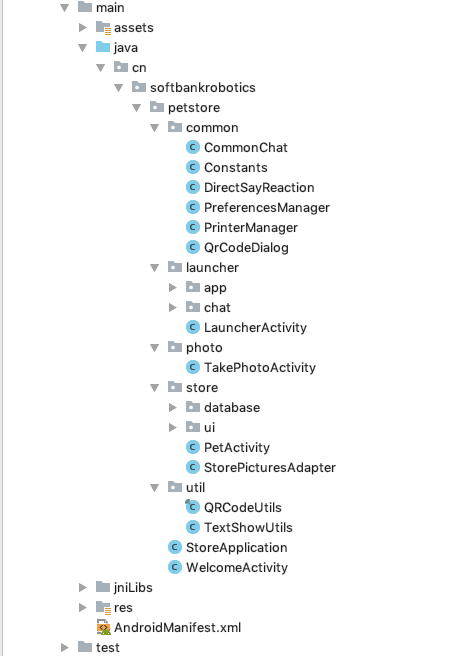

# Petstore

##项目介绍

petstore在QiSDK的基础上，结合宠物商店场景开发的具有对话、舞蹈和拍照等功能的人机交互应用。

## 项目组成

### 项目功能模块

| 项目功能 | 功能描述             |
| -------- | -------------------- |
| 宠物之家 | 宠物预览、选择和支付 |
| 舞蹈     | 调起三方应用         |
| 拍照     | 拍照、打印           |

### 项目结构

如上图所示项目项目结构，主要代码介绍如下：

1）包common下面是公用的类例如cn.softbankrobotics.petstore.common.PrinterManager是打印管理类。

2）包launcher下面有app包、chat包和cn.softbankrobotics.petstore.launcher.LauncherActivity。

注：demo中接入讯飞语义理解（nlp），首先进入讯飞开放平台（<https://aiui.iflyos.cn/apps>）创建应用，在应用信息里面可以看到有我们需要的打包在客户端的APPID 与KEY，
其次在“开发工具”进入下载页面，点击“下载最新版本AIUI SDK”去下载SDK，最后在项目中导入讯飞nlp的sdk（参照讯飞官方文档导入步骤），用demo中的aiui_phone.cfg文件并将其中的
"appid"与"key"替换成创建应用对应的"appid"与"key"。

| 包/类            | 介绍                                         |
| ---------------- | :------------------------------------------- |
| 包app            | 对本地安装app信息下载及处理                  |
| 包chat           | 人机语音对话                                 |
| LauncherActivity | 集成了宠物之家、舞蹈和拍照，等同MainActivity |

3）包photo下是cn.softbankrobotics.petstore.photo.TakePhotoActivity，TakePhotoActivity里面主要集成了基于人机语音交互的拍照和打印功能。
cn.softbankrobotics.petstore.common.PreviewHelper实现preview功能，其中方法initPreviewService(Activity mActivity, ProgressBar mProgressBar, ImageView mIvPlayer)中
new RobotConnectionConfigration("foo","bar")，要输入对应的机器人的SSH账号和密码。

4）包store下面包含包database,包ui和cn.softbankrobotics.petstore.store.PetActivity。

| 包/类       | 介绍                                         |
| ----------- | :------------------------------------------- |
| 包database  | 建立本地数据库的管理                         |
| 包ui        | 轮播ui                                       |
| PetActivity | 集成了宠物之家、舞蹈和拍照，等同MainActivity |

5）utils下面：cn.softbankrobotics.petstore.util.QRCodeUtils生成二维码。

cn.softbankrobotics.petstore.util.TextShowUtils字符跳动显示处理。

## 项目用到QiSDK介绍

| QiSDK API                                                    | 项目中应用                                                   |
| ------------------------------------------------------------ | :----------------------------------------------------------- |
| com.aldebaran.qi.sdk.object.conversation.Say                 | cn.softbankrobotics.petstore.toGreet()                       |
| com.aldebaran.qi.sdk.object.human.Human                      | cn.softbankrobotics.petstore.retrieveHumanAroundParams(QiContext qiContext) |
| com.aldebaran.qi.sdk.object.humanawareness.EngageHuman       | cn.softbankrobotics.petstore.launcher.retrieveHumanParams(Human engagedHuman) |
| com.aldebaran.qi.sdk.object.conversation.Chat                | cn.softbankrobotics.petstore.common.createChat(QiContext qiContent,int resource) |
| com.aldebaran.qi.sdk.object.conversation.BaseChatbot         | cn.softbankrobotics.petstore.launcher.chat.LauncherChatbot   |
| com.aldebaran.qi.sdk.object.conversation.BaseChatbotReaction | cn.softbankrobotics.petstore.launcher.chat.LauncherChatbotReaction |
| com.aldebaran.qi.sdk.object.conversation.QiChatbot           | cn.softbankrobotics.petstore.common.createChat(QiContext qiContent,int resource) |
| com.aldebaran.qi.sdk.object.conversation.Topic               | cn.softbankrobotics.petstore.common.createChat(QiContext qiContent,int resource) |